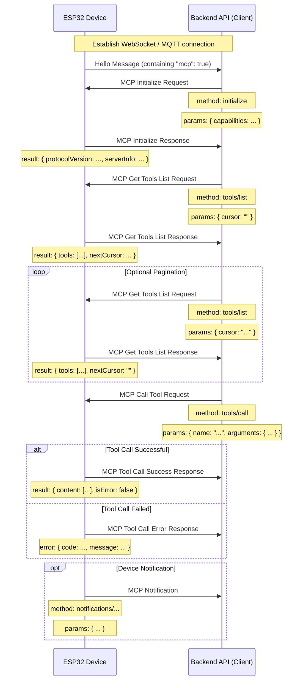

# MCP (Model Context Protocol) Interaction Flow

NOTICE: AI assisted generation, when implementing backend service, please refer to code to confirm details!!

The MCP protocol in this project is used for communication between the backend API (MCP client) and the ESP32 device (MCP server), so that the backend can discover and call the functions (tools) provided by the device.

## Protocol Format

According to the code (`main/protocols/protocol.cc`, `main/mcp_server.cc`), MCP messages are encapsulated in the message body of the basic communication protocol (such as WebSocket or MQTT). Its internal structure follows the [JSON-RPC 2.0](https://www.jsonrpc.org/specification) specification.

Overall message structure example:

```json
{
  "session_id": "...", // Session ID
  "type": "mcp",       // Message type, fixed as "mcp"
  "payload": {         // JSON-RPC 2.0 payload
    "jsonrpc": "2.0",
    "method": "...",   // Method name (such as "initialize", "tools/list", "tools/call")
    "params": { ... }, // Method parameters (for request)
    "id": ...,         // Request ID (for request and response)
    "result": { ... }, // Method execution result (for success response)
    "error": { ... }   // Error information (for error response)
  }
}
```

Among them, the `payload` part is a standard JSON-RPC 2.0 message:

- `jsonrpc`: Fixed string "2.0".
- `method`: The method name to be called (for Request).
- `params`: The method's parameters, a structured value, usually an object (for Request).
- `id`: The request identifier, provided by the client when sending the request, returned as-is by the server when responding. Used to match requests and responses.
- `result`: The result when the method is successfully executed (for Success Response).
- `error`: The error information when the method execution fails (for Error Response).

## Interaction Flow and Sending Timing

MCP interaction mainly revolves around the client (backend API) discovering and calling "tools" on the device.

1.  **Connection Establishment and Capability Announcement**

    - **Timing:** After the device starts up and successfully connects to the backend API.
    - **Sender:** Device.
    - **Message:** The device sends the basic protocol's "hello" message to the backend API, the message contains the list of capabilities supported by the device, for example by supporting the MCP protocol (`"mcp": true`).
    - **Example (not MCP payload, but basic protocol message):**
      ```json
      {
        "type": "hello",
        "version": ...,
        "features": {
          "mcp": true,
          ...
        },
        "transport": "websocket", // or "mqtt"
        "audio_params": { ... },
        "session_id": "..." // Device may set after receiving server hello
      }
      ```

2.  **Initialize MCP Session**

    - **Timing:** After the backend API receives the device "hello" message and confirms the device supports MCP, usually sent as the first request of the MCP session.
    - **Sender:** Backend API (client).
    - **Method:** `initialize`
    - **Message (MCP payload):**

      ```json
      {
        "jsonrpc": "2.0",
        "method": "initialize",
        "params": {
          "capabilities": {
            // Client capabilities, optional

            // Camera vision related
            "vision": {
              "url": "...", //Camera: Image processing address (must be http address, not websocket address)
              "token": "..." // url token
            }

            // ... other client capabilities
          }
        },
        "id": 1 // Request ID
      }
      ```

    - **Device Response Timing:** After the device receives the `initialize` request and processes it.
    - **Device Response Message (MCP payload):**
      ```json
      {
        "jsonrpc": "2.0",
        "id": 1, // Match request ID
        "result": {
          "protocolVersion": "2024-11-05",
          "capabilities": {
            "tools": {} // The tools here do not list detailed information, need tools/list
          },
          "serverInfo": {
            "name": "...", // Device name (BOARD_NAME)
            "version": "..." // Device firmware version
          }
        }
      }
      ```

3.  **Discover Device Tool List**

    - **Timing:** When the backend API needs to obtain the specific functions (tools) currently supported by the device and their calling methods.
    - **Sender:** Backend API (client).
    - **Method:** `tools/list`
    - **Message (MCP payload):**
      ```json
      {
        "jsonrpc": "2.0",
        "method": "tools/list",
        "params": {
          "cursor": "" // Used for pagination, empty string for first request
        },
        "id": 2 // Request ID
      }
      ```
    - **Device Response Timing:** After the device receives the `tools/list` request and generates the tool list.
    - **Device Response Message (MCP payload):**
      ```json
      {
        "jsonrpc": "2.0",
        "id": 2, // Match request ID
        "result": {
          "tools": [ // Tool object list
            {
              "name": "self.get_device_status",
              "description": "...",
              "inputSchema": { ... } // Parameter schema
            },
            {
              "name": "self.audio_speaker.set_volume",
              "description": "...",
              "inputSchema": { ... } // Parameter schema
            }
            // ... more tools
          ],
          "nextCursor": "..." // If the list is large and needs pagination, this will contain the cursor value for the next request
        }
      }
      ```
    - **Pagination Handling:** If the `nextCursor` field is not empty, the client needs to send the `tools/list` request again, and include this `cursor` value in `params` to get the next page of tools.

4.  **Call Device Tool**

    - **Timing:** When the backend API needs to execute a specific function on the device.
    - **Sender:** Backend API (client).
    - **Method:** `tools/call`
    - **Message (MCP payload):**
      ```json
      {
        "jsonrpc": "2.0",
        "method": "tools/call",
        "params": {
          "name": "self.audio_speaker.set_volume", // Tool name to call
          "arguments": {
            // Tool parameters, object format
            "volume": 50 // Parameter name and value
          }
        },
        "id": 3 // Request ID
      }
      ```
    - **Device Response Timing:** After the device receives the `tools/call` request and executes the corresponding tool function.
    - **Device Success Response Message (MCP payload):**
      ```json
      {
        "jsonrpc": "2.0",
        "id": 3, // Match request ID
        "result": {
          "content": [
            // Tool execution result content
            { "type": "text", "text": "true" } // Example: set_volume returns bool
          ],
          "isError": false // Indicates success
        }
      }
      ```
    - **Device Failure Response Message (MCP payload):**
      ```json
      {
        "jsonrpc": "2.0",
        "id": 3, // Match request ID
        "error": {
          "code": -32601, // JSON-RPC error code, such as Method not found (-32601)
          "message": "Unknown tool: self.non_existent_tool" // Error description
        }
      }
      ```

5.  **Device Actively Sends Message (Notifications)**
    - **Timing:** When an event occurs inside the device that needs to notify the backend API (for example, status change, although there are no clear tools sending such messages in the code example, but the existence of `Application::SendMcpMessage` implies that the device may actively send MCP messages).
    - **Sender:** Device (server).
    - **Method:** Possibly method names starting with `notifications/`, or other custom methods.
    - **Message (MCP payload):** Follows JSON-RPC Notification format, no `id` field.
      ```json
      {
        "jsonrpc": "2.0",
        "method": "notifications/state_changed", // Example method name
        "params": {
          "newState": "idle",
          "oldState": "connecting"
        }
        // No id field
      }
      ```
    - **Backend API Handling:** After receiving the Notification, the backend API processes accordingly, but does not reply.

## Interaction Diagram

Below is a simplified interaction sequence diagram showing the main MCP message flow:



This document outlines the main interaction flow of the MCP protocol in this project. Specific parameter details and tool functions need to refer to `main/mcp_server.cc` in `McpServer::AddCommonTools` and the implementation of each tool.
