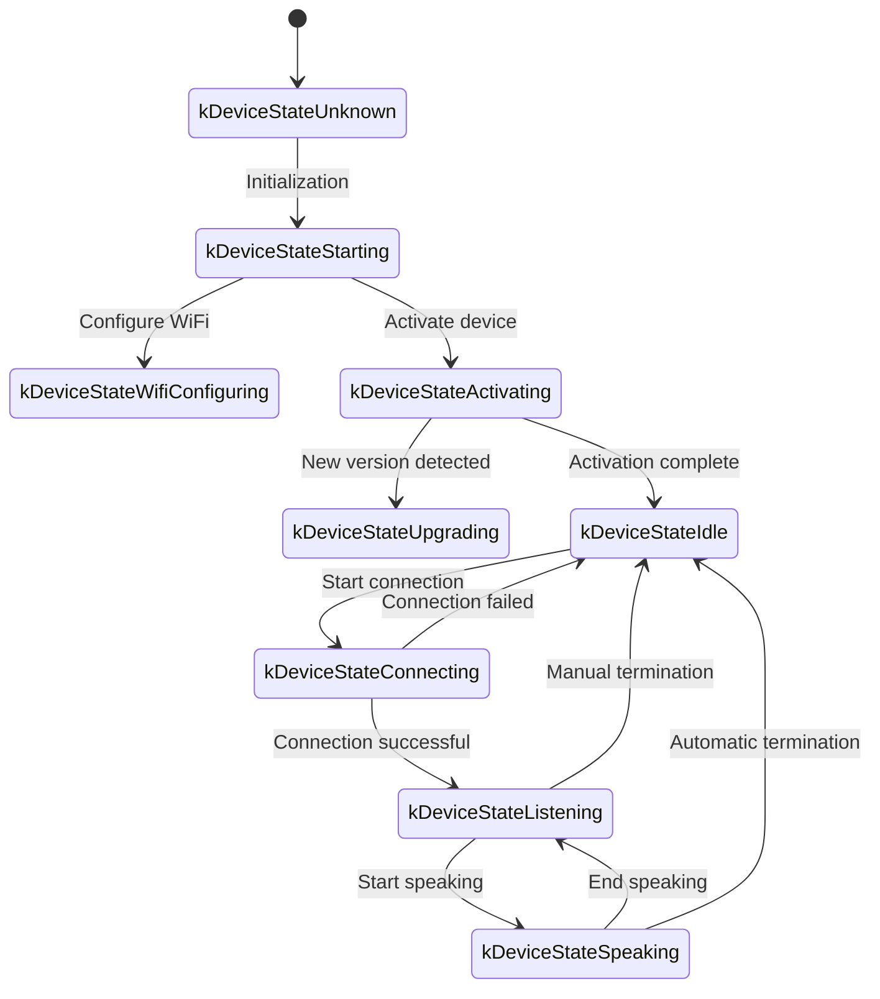
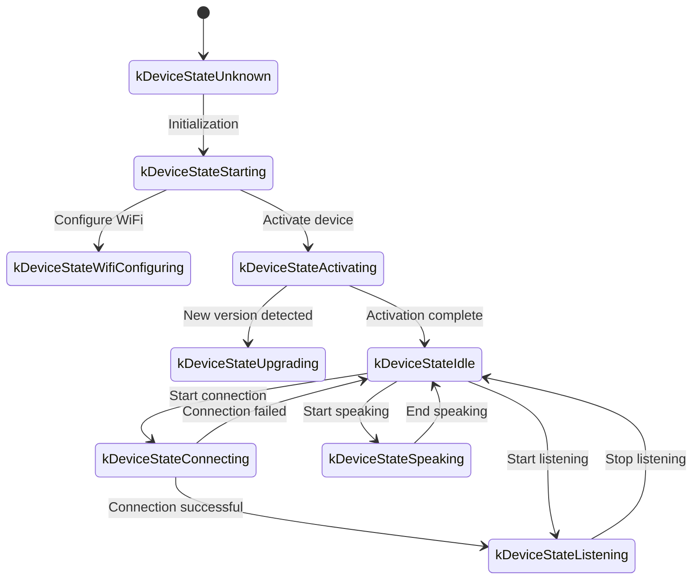

The following is a WebSocket communication protocol document compiled based on code implementation, outlining how device-side and server interact through WebSocket.

This document is only inferred based on the provided code, and may need further confirmation or supplementation in combination with server-side implementation during actual deployment.

---

## 1. Overall Flow Overview

1. **Device-side Initialization**
   - Device powers on, initializes `Application`:
     - Initializes audio codec, display, LED, etc.
     - Connects to network
     - Creates and initializes WebSocket protocol instance (`WebsocketProtocol`) implementing `Protocol` interface
   - Enters main loop waiting for events (audio input, audio output, scheduled tasks, etc.).

2. **Establish WebSocket Connection**
   - When device needs to start voice session (such as user wake-up, manual button trigger, etc.), call `OpenAudioChannel()`:
     - Get WebSocket URL according to configuration
     - Set several request headers (`Authorization`, `Protocol-Version`, `Device-Id`, `Client-Id`)
     - Call `Connect()` to establish WebSocket connection with server

3. **Device-side sends "hello" message**
   - After connection success, device sends a JSON message, example structure as follows:
   ```json
   {
     "type": "hello",
     "version": 1,
     "features": {
       "mcp": true
     },
     "transport": "websocket",
     "audio_params": {
       "format": "opus",
       "sample_rate": 16000,
       "channels": 1,
       "frame_duration": 60
     }
   }
   ```
   - The `features` field is optional, content automatically generated according to device compilation configuration. For example: `"mcp": true` indicates support for MCP protocol.
   - `frame_duration` value corresponds to `OPUS_FRAME_DURATION_MS` (such as 60ms).

4. **Server replies "hello"**
   - Device waits for server to return a JSON message containing `"type": "hello"`, and checks if `"transport": "websocket"` matches.
   - Server optionally issues `session_id` field, device-side automatically records after receiving.
   - Example:
   ```json
   {
     "type": "hello",
     "transport": "websocket",
     "session_id": "xxx",
     "audio_params": {
       "format": "opus",
       "sample_rate": 24000,
       "channels": 1,
       "frame_duration": 60
     }
   }
   ```
   - If matches, considers server ready, marks audio channel open success.
   - If correct reply not received within timeout (default 10 seconds), considers connection failed and triggers network error callback.

5. **Subsequent Message Interaction**
   - Device-side and server-side can send two main types of data:
     1. **Binary audio data** (Opus encoded)
     2. **Text JSON messages** (for transmitting chat status, TTS/STT events, MCP protocol messages, etc.)

   - In the code, receive callbacks are mainly divided into:
     - `OnData(...)`:
       - When `binary` is `true`, considered audio frame; device decodes it as Opus data.
       - When `binary` is `false`, considered JSON text, needs to be parsed with cJSON on device-side and handle corresponding business logic (such as chat, TTS, MCP protocol messages, etc.).

   - When server or network disconnects, callback `OnDisconnected()` is triggered:
     - Device calls `on_audio_channel_closed_()`, and finally returns to idle state.

6. **Close WebSocket Connection**
   - When device needs to end voice session, calls `CloseAudioChannel()` to actively disconnect and return to idle state.
   - Or if server actively disconnects, triggers same callback flow.

---

## 2. General Request Headers

When establishing WebSocket connection, the following request headers are set in the code example:

- `Authorization`: Used to store access token, in the form `"Bearer <token>"`
- `Protocol-Version`: Protocol version number, consistent with `version` field in hello message body
- `Device-Id`: Device physical network card MAC address
- `Client-Id`: Software generated UUID (reset when erasing NVS or reflashing complete firmware)

These headers are sent to the server along with WebSocket handshake, server can verify, authenticate, etc. as needed.

---

## 3. Binary Protocol Versions

Device supports multiple binary protocol versions, specified through `version` field in configuration:

### 3.1 Version 1 (Default)
Directly send Opus audio data, no additional metadata. Websocket protocol distinguishes text and binary.

### 3.2 Version 2
Use `BinaryProtocol2` structure:
```c
struct BinaryProtocol2 {
    uint16_t version;        // Protocol version
    uint16_t type;           // Message type (0: OPUS, 1: JSON)
    uint32_t reserved;       // Reserved field
    uint32_t timestamp;      // Timestamp (milliseconds, for server-side AEC)
    uint32_t payload_size;   // Payload size (bytes)
    uint8_t payload[];       // Payload data
} __attribute__((packed));
```

### 3.3 Version 3
Use `BinaryProtocol3` structure:
```c
struct BinaryProtocol3 {
    uint8_t type;            // Message type
    uint8_t reserved;        // Reserved field
    uint16_t payload_size;   // Payload size
    uint8_t payload[];       // Payload data
} __attribute__((packed));
```

---

## 4. JSON Message Structure

WebSocket text frames transmitted in JSON format, following are common `"type"` fields and their corresponding business logic. If message contains unlisted fields, may be optional or specific implementation details.

### 4.1 Device-side → Server

1. **Hello**
   - Sent by device-side after connection success, informs server of basic parameters.
   - Example:
     ```json
     {
       "type": "hello",
       "version": 1,
       "features": {
         "mcp": true
       },
       "transport": "websocket",
       "audio_params": {
         "format": "opus",
         "sample_rate": 16000,
         "channels": 1,
         "frame_duration": 60
       }
     }
     ```

2. **Listen**
   - Indicates device-side starts or stops recording listening.
   - Common fields:
     - `"session_id"`: Session identifier
     - `"type": "listen"`
     - `"state"`: `"start"`, `"stop"`, `"detect"` (wake word detection triggered)
     - `"mode"`: `"auto"`, `"manual"` or `"realtime"`, indicates recognition mode.
   - Example: Start listening
     ```json
     {
       "session_id": "xxx",
       "type": "listen",
       "state": "start",
       "mode": "manual"
     }
     ```

3. **Abort**
   - Terminate current speaking (TTS playback) or voice channel.
   - Example:
     ```json
     {
       "session_id": "xxx",
       "type": "abort",
       "reason": "wake_word_detected"
     }
     ```
   - `reason` value can be `"wake_word_detected"` or others.

4. **Wake Word Detected**
   - Used for device-side to inform server of wake word detection.
   - Before sending this message, can send wake word Opus audio data in advance for server voiceprint detection.
   - Example:
     ```json
     {
       "session_id": "xxx",
       "type": "listen",
       "state": "detect",
       "text": "你好小明"
     }
     ```

5. **MCP**
   - Recommended new generation protocol for IoT control. All device capability discovery, tool calls, etc. are performed through messages with type: "mcp", payload internally is standard JSON-RPC 2.0 (see [MCP Protocol Document](./mcp-protocol.md)).
   
   - **Device-side to server sending result example:**
     ```json
     {
       "session_id": "xxx",
       "type": "mcp",
       "payload": {
         "jsonrpc": "2.0",
         "id": 1,
         "result": {
           "content": [
             { "type": "text", "text": "true" }
           ],
           "isError": false
         }
       }
     }
     ```

---

### 4.2 Server → Device-side

1. **Hello**
   - Server-side returned handshake confirmation message.
   - Must contain `"type": "hello"` and `"transport": "websocket"`.
   - May carry `audio_params`, indicating server's expected audio parameters, or configuration aligned with device-side.
   - Server optionally issues `session_id` field, device-side automatically records after receiving.
   - After successful reception, device-side sets event flag, indicating WebSocket channel ready.

2. **STT**
   - `{"session_id": "xxx", "type": "stt", "text": "..."}`
   - Indicates server-side recognized user speech. (Such as speech-to-text result)
   - Device may display this text on screen, then enter answering process, etc.

3. **LLM**
   - `{"session_id": "xxx", "type": "llm", "emotion": "happy", "text": "😀"}`
   - Server instructs device to adjust expression animation / UI expression.

4. **TTS**
   - `{"session_id": "xxx", "type": "tts", "state": "start"}`: Server prepares to issue TTS audio, device-side enters "speaking" playback state.
   - `{"session_id": "xxx", "type": "tts", "state": "stop"}`: Indicates this TTS ends.
   - `{"session_id": "xxx", "type": "tts", "state": "sentence_start", "text": "..."}`
     - Lets device display current text segment to be played or read aloud on interface (for example for displaying to user).

5. **MCP**
   - Server issues IoT related control instructions or returns call results through messages with type: "mcp", payload structure same as above.
   
   - **Server to device-side sending tools/call example:**
     ```json
     {
       "session_id": "xxx",
       "type": "mcp",
       "payload": {
         "jsonrpc": "2.0",
         "method": "tools/call",
         "params": {
           "name": "self.light.set_rgb",
           "arguments": { "r": 255, "g": 0, "b": 0 }
         },
         "id": 1
       }
     }
     ```

6. **System**
   - System control commands, commonly used for remote upgrade updates.
   - Example:
     ```json
     {
       "session_id": "xxx",
       "type": "system",
       "command": "reboot"
     }
   ```
   - Supported commands:
     - `"reboot"`: Reboot device

7. **Custom** (Optional)
   - Custom messages, supported when `CONFIG_RECEIVE_CUSTOM_MESSAGE` is enabled.
   - Example:
     ```json
     {
       "session_id": "xxx",
       "type": "custom",
       "payload": {
         "message": "Custom content"
       }
     }
     ```

8. **Audio Data: Binary Frames**
   - When server sends audio binary frames (Opus encoded), device-side decodes and plays.
   - If device-side is in "listening" (recording) state, received audio frames will be ignored or cleared to prevent conflicts.

---

## 5. Audio Encoding/Decoding

1. **Device-side sends recording data**
   - Audio input goes through possible echo cancellation, noise reduction or volume gain, then encoded with Opus and packaged as binary frames sent to server.
   - According to protocol version, may directly send Opus data (version 1) or use binary protocol with metadata (version 2/3).

2. **Device-side plays received audio**
   - When receiving binary frames from server, also considered Opus data.
   - Device-side decodes, then hands to audio output interface for playback.
   - If server's audio sample rate differs from device, resamples after decoding.

---

## 6. Common State Transitions

Following are common device-side key state transitions, corresponding to WebSocket messages:

1. **Idle** → **Connecting**
   - After user trigger or wake-up, device calls `OpenAudioChannel()` → Establish WebSocket connection → Send `"type":"hello"`.

2. **Connecting** → **Listening**
   - After successful connection establishment, if continues to execute `SendStartListening(...)`, enters recording state. Device will continuously encode microphone data and send to server.

3. **Listening** → **Speaking**
   - Receive server TTS Start message (`{"type":"tts","state":"start"}`) → Stop recording and play received audio.

4. **Speaking** → **Idle**
   - Server TTS Stop (`{"type":"tts","state":"stop"}`) → Audio playback ends. If not continuing to automatic listening, return to Idle; if automatic loop configured, enter Listening again.

5. **Listening** / **Speaking** → **Idle** (encounter exception or active interrupt)
   - Call `SendAbortSpeaking(...)` or `CloseAudioChannel()` → Interrupt session → Close WebSocket → State returns to Idle.

### Automatic Mode State Transition Diagram



### Manual Mode State Transition Diagram



---

## 7. Error Handling

1. **Connection Failure**
   - If `Connect(url)` returns failure or times out waiting for server "hello" message, triggers `on_network_error_()` callback. Device will prompt "Unable to connect to service" or similar error message.

2. **Server Disconnect**
   - If WebSocket abnormally disconnects, callback `OnDisconnected()`:
     - Device callback `on_audio_channel_closed_()`
     - Switch to Idle or other retry logic.

---

## 8. Other Notes

1. **Authentication**
   - Device provides authentication by setting `Authorization: Bearer <token>`, server-side needs to verify validity.
   - If token expired or invalid, server can reject handshake or disconnect subsequently.

2. **Session Control**
   - Some messages in code contain `session_id`, used to distinguish independent conversations or operations. Server-side can separate processing for different sessions as needed.

3. **Audio Payload**
   - Code defaults to Opus format, sets `sample_rate = 16000`, mono. Frame duration controlled by `OPUS_FRAME_DURATION_MS`, generally 60ms. Can adjust appropriately according to bandwidth or performance. To get better music playback effect, server downlink audio may use 24000 sample rate.

4. **Protocol Version Configuration**
   - Configure binary protocol version (1, 2 or 3) through `version` field in settings
   - Version 1: Directly send Opus data
   - Version 2: Use binary protocol with timestamp, suitable for server-side AEC
   - Version 3: Use simplified binary protocol

5. **IoT Control Recommends MCP Protocol**
   - IoT capability discovery, status synchronization, control instructions, etc. between device and server, recommend all implemented through MCP protocol (type: "mcp"). Original type: "iot" scheme has been deprecated.
   - MCP protocol can be transmitted over multiple underlying protocols such as WebSocket, MQTT, with better scalability and standardization capabilities.
   - For detailed usage, please refer to [MCP Protocol Document](./mcp-protocol.md) and [MCP IoT Control Usage](./mcp-usage.md).

6. **Error or Abnormal JSON**
   - When necessary fields missing in JSON, such as `{"type": ...}`, device-side will log error (`ESP_LOGE(TAG, "Missing message type, data: %s", data);`), will not execute any business.

---

## 9. Message Examples

Below gives a typical bidirectional message example (flow simplified illustration):

1. **Device-side → Server** (Handshake)
   ```json
   {
     "type": "hello",
     "version": 1,
     "features": {
       "mcp": true
     },
     "transport": "websocket",
     "audio_params": {
       "format": "opus",
       "sample_rate": 16000,
       "channels": 1,
       "frame_duration": 60
     }
   }
   ```

2. **Server → Device-side** (Handshake response)
   ```json
   {
     "type": "hello",
     "transport": "websocket",
     "session_id": "xxx",
     "audio_params": {
       "format": "opus",
       "sample_rate": 16000
     }
   }
   ```

3. **Device-side → Server** (Start listening)
   ```json
   {
     "session_id": "xxx",
     "type": "listen",
     "state": "start",
     "mode": "auto"
   }
   ```
   Device-side simultaneously starts sending binary frames (Opus data).

4. **Server → Device-side** (ASR result)
   ```json
   {
     "session_id": "xxx",
     "type": "stt",
     "text": "What user said"
   }
   ```

5. **Server → Device-side** (TTS start)
   ```json
   {
     "session_id": "xxx",
     "type": "tts",
     "state": "start"
   }
   ```
   Server then sends binary audio frames to device-side for playback.

6. **Server → Device-side** (TTS end)
   ```json
   {
     "session_id": "xxx",
     "type": "tts",
     "state": "stop"
   }
   ```
   Device-side stops playing audio, if no more instructions, returns to idle state.

---

## 10. Summary

This protocol completes functions including audio stream upload, TTS audio playback, speech recognition and status management, MCP instruction issuance, etc. by transmitting JSON text and binary audio frames on WebSocket upper layer. Its core features:

- **Handshake Phase**: Send `"type":"hello"`, wait for server return.
- **Audio Channel**: Bidirectional transmission of voice streams using Opus encoded binary frames, supports multiple protocol versions.
- **JSON Messages**: Use `"type"` as core field to identify different business logic, including TTS, STT, MCP, WakeWord, System, Custom, etc.
- **Extensibility**: Can add fields in JSON messages according to actual needs, or perform additional authentication in headers.

Server and device-side need to agree in advance on field meanings, timing logic and error handling rules of various messages to ensure smooth communication. The above information can serve as basic documentation, facilitating subsequent docking, development or expansion.
